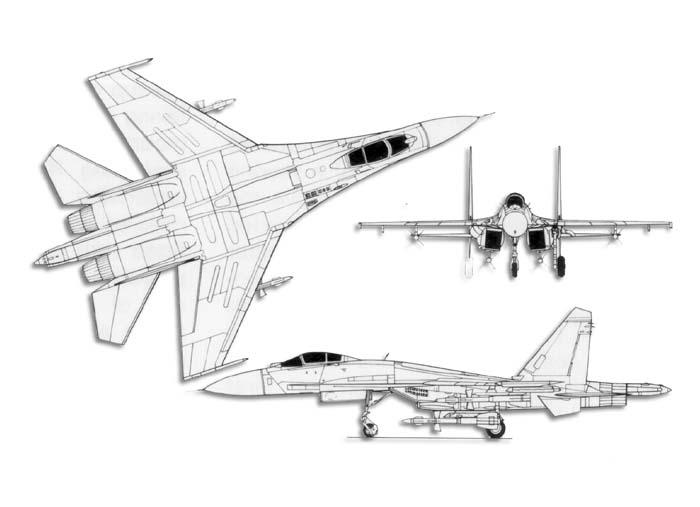

title: 航空知识（1）SU-27
date: 2006-12-23
categories: 航空知识

Su-27：

    研制国家：俄罗斯（前苏联），名称：侧卫（Flanker）

一、概述：  
    Su-27于六十年代末由前苏联苏霍伊设计局设计的一种单座双发全天侯重型制空战斗机。当时，美国受前苏联全天候改进型[Mig-21D](mk:@MSITStore:C:/Documents%20and%20Settings/Administrator/桌面/飞机手册1.CHM::/Mig-21.htm)、[Mig-25](mk:@MSITStore:C:/Documents%20and%20Settings/Administrator/桌面/飞机手册1.CHM::/Mig-25.htm)原型机和[Mig-23](mk:@MSITStore:C:/Documents%20and%20Settings/Administrator/桌面/飞机手册1.CHM::/Mig-23.htm)原型机首飞成功的影响，从1965年开始相继提出了[F-15“鹰”](mk:@MSITStore:C:/Documents%20and%20Settings/Administrator/桌面/飞机手册1.CHM::/f-15.htm)型战斗机计划和[F-16“战隼”](mk:@MSITStore:C:/Documents%20and%20Settings/Administrator/桌面/飞机手册1.CHM::/f-16.htm)轻型战斗机计划作为美国空军未来的新主力战斗机，并形成“高低搭配”的概念。而与YF-16竞争轻型战斗机计划失败而落选的YF-17则被美国海军看中成为其主力舰载机[F/A-18“大黄蜂”](mk:@MSITStore:C:/Documents%20and%20Settings/Administrator/桌面/飞机手册1.CHM::/f-18.htm)。苏联人当然不甘落后，作为回应，于1969年开始进行有针对性的未来前线战斗机招标，其主要目标就是要超越[F-15](mk:@MSITStore:C:/Documents%20and%20Settings/Administrator/桌面/飞机手册1.CHM::/f-15.htm)，所以这个计划也简称为“反F-15”（Anti-F-15）。   
    参与竞标的有雅克福列夫设计局Yak-45、米高扬设计局的[Mig-29](mk:@MSITStore:C:/Documents%20and%20Settings/Administrator/桌面/飞机手册1.CHM::/Mig-29.htm)以及苏霍伊设计局的T-10（Su-27的原型机，为苏霍伊设计局内部编号，T即Triangular代表三角翼布局，10代表苏霍伊设计局的第十种三角翼飞机）。经过一番激烈竞争后，当局决定发展较轻的[Mig-29](mk:@MSITStore:C:/Documents%20and%20Settings/Administrator/桌面/飞机手册1.CHM::/Mig-29.htm)以对抗[F-16](mk:@MSITStore:C:/Documents%20and%20Settings/Administrator/桌面/飞机手册1.CHM::/f-16.htm)、发展重型的Su-27以对抗[F-15](mk:@MSITStore:C:/Documents%20and%20Settings/Administrator/桌面/飞机手册1.CHM::/f-15.htm)。   
    当时前苏联在先进材料技术（尤其是钛金属）方面和在电传操纵系统方面（已在苏霍伊T-4上试验成功）具有一定优势，这对后来Su-27的发展起了很大作用。不过据传，总设计师帕维尔．奥．苏霍伊认为靠那时候苏联的科技水平尤其是航空电子方面，要造出比[F-15](mk:@MSITStore:C:/Documents%20and%20Settings/Administrator/桌面/飞机手册1.CHM::/f-15.htm)好的飞机几乎是不可能的。但到后来前苏联科技人员忘我的工作热情与辉煌的成果使他对自己的项目充满了信心。只可惜他自己没能等到Su-27上天的那一刻，苏霍伊于1975年9月15日与世长辞。在这之后由西蒙诺夫担任总设计师之职。   
    当原型机在1980年首飞后一直受机体与设备超重情况困扰。在1979年11月发生叙利亚6架[Mig-23](mk:@MSITStore:C:/Documents%20and%20Settings/Administrator/桌面/飞机手册1.CHM::/Mig-23.htm)与2架以色列的[F-15A](mk:@MSITStore:C:/Documents%20and%20Settings/Administrator/桌面/飞机手册1.CHM::/f-15.htm)对抗事件，结果是米格机大败。空战过程分析出来后让苏联大为吃惊，[F-15](mk:@MSITStore:C:/Documents%20and%20Settings/Administrator/桌面/飞机手册1.CHM::/f-15.htm)的空战性能远超过原来估计。Su-27原型机设计能力完全没有压制[F-15](mk:@MSITStore:C:/Documents%20and%20Settings/Administrator/桌面/飞机手册1.CHM::/f-15.htm)能力。受军方对提高Su-27性能要求的刺激，总设计师西蒙诺夫提出改变飞机横截面积，改变气动布局等一系列改进方案。并且在改进方案中巧妙的利用发动机短舱使其成为主支撑的侧面支撑点。为了能提高结构强度，降低重量，大量采用了钛合金设计。这一系列改变按照总设计师的说法是：除了轮胎、主起落架支肋和优秀的K36弹射座椅外，全部部件均要重新设计与制造。   
    这样一来导致了许多单位与权威人士反对。总设计师抱着必须设计出世界最优秀战斗机理想，找到了非官方战斗研究机构：西伯利亚研究院气动专家卡沙夫斯基诺夫帮忙，卡沙夫斯基诺夫更成为日后Su-27气动外形的创始人。   
    改进工作与原型机试飞工作是同时进行的。当T-10-1试飞成功时（Su-27系列的第一架原型机），全新改型机也开始组装。虽然T-10-1与Su-27外表近似，但是T-10-1是传统布局，Su-27是随控布局，两者机动性能天差地别。1981年进行了飞行试验，由于改动太大，原来准备批量生产的设备均无法用于现在的改型飞机，一直等到1982年初，在共青城才结束了结构加强型的Su-27批量装配准备工作。而[Mig-29](mk:@MSITStore:C:/Documents%20and%20Settings/Administrator/桌面/飞机手册1.CHM::/Mig-29.htm)已经于1983年开始交付部队使用。在各种压力下，Su-27面临可能流产的境地。   
    西蒙诺夫在仔细研究[Mig-29](mk:@MSITStore:C:/Documents%20and%20Settings/Administrator/桌面/飞机手册1.CHM::/Mig-29.htm)与[F-15](mk:@MSITStore:C:/Documents%20and%20Settings/Administrator/桌面/飞机手册1.CHM::/f-15.htm)后得出结论：[Mig-29](mk:@MSITStore:C:/Documents%20and%20Settings/Administrator/桌面/飞机手册1.CHM::/Mig-29.htm)并没有全面超过[F-15](mk:@MSITStore:C:/Documents%20and%20Settings/Administrator/桌面/飞机手册1.CHM::/f-15.htm)。所以认为Su-27还是有希望的。军方内的狂热支持者也对Su-27继续投产起了很大的帮助作用。他们的目标非常简单明确：苏联必须拥有超过[F-15](mk:@MSITStore:C:/Documents%20and%20Settings/Administrator/桌面/飞机手册1.CHM::/f-15.htm)的第一流战斗机。   
    在苏联复合材料工艺缺乏情况下，Su-27采用了大量钛合金结构解决飞机应力问题。为了能解决钛合金大型构件与薄壁构件焊接问题，专门设计了车间进行制造。全新原理下制造的雷达与电子设备也给工厂调试带来困难。  
    1982年5月31日，第一架采用全新气动设计的17号原型机试飞。试飞后期发生事故，由于钛合金焊接问题，机翼散架。直到1987年完成严格测试的军用型Su-27才交付军队使用。   
    与此同时，还没有等Su-27完成测试，Su-27双座教练机也于1984年完成设计与制造。1985年完成测试投入生产的就是Su-27UB。在这些工作进行中的时候，Su-27加装前三角翼的工作也在展开，航母用的[Su-27K（Su-33）](mk:@MSITStore:C:/Documents%20and%20Settings/Administrator/桌面/飞机手册1.CHM::/Su-33.htm)系列也在积极进行研制。这个决定在日后被证明是个非常有战略眼光的决定。   
    Su-27在研制中突出了飞机的机动性与武器的下射能力，采用了高推重比、低翼载设计。航程远，与预警机配合能有效地对低空目标进行远距截击，能进行超视距空战，同时兼有地地攻击能力。中国于90年代曾购买了一定数量的Su-27战斗机，并引进技术生产了[歼-11](mk:@MSITStore:C:/Documents%20and%20Settings/Administrator/桌面/飞机手册1.CHM::/歼-11.htm)战斗机。  
    随着世界各国武器装备更新步伐加快，俄军现役的Su-27战斗机日趋落伍，而一些诸如[Su-30](mk:@MSITStore:C:/Documents%20and%20Settings/Administrator/桌面/飞机手册1.CHM::/Su-30.htm)等新机型优先用于出口来赢利，俄军飞行员中普遍抱怨认为，俄军工企业只知道将新型航空发动机出售给印度等国外用户赢利，而对俄军现役战机缺乏升级、平时训练飞行存在空中解体安全隐患不闻不问。随着近来连续几年俄罗斯经济状况逐渐好转，开始有力量升级和新购武器装备给日趋落伍的俄军。俄罗斯军方官员2003年12月26日宣布，作为俄军1991年前苏联解体后最大规模军事现代化计划的一部分，俄空军将给其现役喷气式战机换上新型发动机和电子设备，来整体提升空军的战斗力，升级俄军Su-27战机群的工作在2005年全部结束，而升级后的Su-27SM战机性能将超过向中国和印度出口的[Su-30MKK](mk:@MSITStore:C:/Documents%20and%20Settings/Administrator/桌面/飞机手册1.CHM::/Su-30.htm)和[Su-30MKI](mk:@MSITStore:C:/Documents%20and%20Settings/Administrator/桌面/飞机手册1.CHM::/Su-30.htm)战斗机。  
    新升级的Su-27SM战机在多方面作了改进，几乎成了一架新飞机，将原先的模拟式测距仪改成了新型的计算机测距仪，并装备了由卫星定位的导航系统，以及更精密的武器火控系统，强化机身能携带更多的武器负载，安装改良N001雷达，玻璃化驾驶座舱焕然一新，安装三个彩色多功能显示器和改良航空电子设备。首批5架试验飞机已经在2003年12月26日换装完成。  
    发动机将全部更换，将更换成莫斯科“礼炮”机器制造厂改进型AL-31 FM1发动机，推力将达到145千牛，新发动机安装在Su-27SM飞机上在2004年3月完成首次测试飞行，这将极大地提高了作战飞机的动力装备。  
    Su-27飞机是一个整个系列产品的先驱，包括Su-27UB双座教练机、[Su-33](mk:@MSITStore:C:/Documents%20and%20Settings/Administrator/桌面/飞机手册1.CHM::/Su-33.htm)舰载战斗机、[Su-30](mk:@MSITStore:C:/Documents%20and%20Settings/Administrator/桌面/飞机手册1.CHM::/Su-30.htm)双座远程战斗机、[Su-35](mk:@MSITStore:C:/Documents%20and%20Settings/Administrator/桌面/飞机手册1.CHM::/Su-35.htm)“超级侧卫”战斗机、[Su-32FN](mk:@MSITStore:C:/Documents%20and%20Settings/Administrator/桌面/飞机手册1.CHM::/Su-32.htm)双座多用途战斗/侦察机、[Su-34](mk:@MSITStore:C:/Documents%20and%20Settings/Administrator/桌面/飞机手册1.CHM::/Su-34.htm)并排双座超远程战斗/轰炸机和[Su-37](mk:@MSITStore:C:/Documents%20and%20Settings/Administrator/桌面/飞机手册1.CHM::/Su-37.htm)先进多任务战斗机。  
    Su-27全系列机型：（Su-27K后更名为[Su-33](mk:@MSITStore:C:/Documents%20and%20Settings/Administrator/桌面/飞机手册1.CHM::/Su-33.htm)）  
    Su-27（设计局号T-10S）：共青城厂为空军制造的基本空优型   
    Su-27IB（设计局号T-10V）：[Su-34](mk:@MSITStore:C:/Documents%20and%20Settings/Administrator/桌面/飞机手册1.CHM::/Su-34.htm)的原型机，由新西伯利亚厂制造   
    Su-27K（设计局号T-10K）：[Su-34](mk:@MSITStore:C:/Documents%20and%20Settings/Administrator/桌面/飞机手册1.CHM::/Su-34.htm)的电子战派生型   
    Su-27KM：配备[Su-35](mk:@MSITStore:C:/Documents%20and%20Settings/Administrator/桌面/飞机手册1.CHM::/Su-35.htm)武器系统的[Su-33](mk:@MSITStore:C:/Documents%20and%20Settings/Administrator/桌面/飞机手册1.CHM::/Su-33.htm)，由共青城厂制造   
    Su-27KPP：[Su-33](mk:@MSITStore:C:/Documents%20and%20Settings/Administrator/桌面/飞机手册1.CHM::/Su-33.htm)的电子战型   
    Su-27KRTS：[Su-33](mk:@MSITStore:C:/Documents%20and%20Settings/Administrator/桌面/飞机手册1.CHM::/Su-33.htm)的侦察型   
    Su-27KU：并列式座舱教练机   
    Su-27KUB（设计局号T-10KUB）：由共青城厂制造的并列式座舰载机   
    Su-27M（设计局号T-10M）：[Su-35](mk:@MSITStore:C:/Documents%20and%20Settings/Administrator/桌面/飞机手册1.CHM::/Su-35.htm)的原型机   
    Su-27P：共青城厂为防空军制造的基本生产型 （就是常说的Su-27S）   
    Su-27PD：加装空中加油装置的Su-27P   
    Su-27PU（设计局号T-10PU）：[Su-30](mk:@MSITStore:C:/Documents%20and%20Settings/Administrator/桌面/飞机手册1.CHM::/Su-30.htm)的原型机   
    Su-27R：[Su-34](mk:@MSITStore:C:/Documents%20and%20Settings/Administrator/桌面/飞机手册1.CHM::/Su-34.htm)的侦察型   
    Su-27SK（设计局号T-10SK）：共青城厂制造的Su-27出口型   
    Su-27SMK：由Su-27SK改良的多功能出口型   
    Su-27UB（设计局号T-10U）：伊尔库斯克厂制造的Su-27双座纵列教练机   
    Su-27UBK（设计局号T-10UBK）：伊尔库斯克厂制造的Su-27UB出口型   
    Su-30：伊尔库斯克厂制造的双座纵列空优战机   
    Su-30I-1：[Su-30MKI](mk:@MSITStore:C:/Documents%20and%20Settings/Administrator/桌面/飞机手册1.CHM::/Su-30.htm)的首架原型机   
    Su-30K：伊尔库斯克厂制造的[Su-30](mk:@MSITStore:C:/Documents%20and%20Settings/Administrator/桌面/飞机手册1.CHM::/Su-30.htm)出口型   
    Su-30K2（暂时型号）：共青城厂制造的双座并列型战机   
    Su-30KI：共青城厂制造出口印尼的Su-27SK   
    Su-30KN：伊尔库斯克厂制造的换装先进雷达的改良型   
    Su-30MK（设计局号T-10PMK）：双座纵列多功能战机的通用型号   
    Su-30MKI：伊尔库斯克厂制造的印度[Su-30MK](mk:@MSITStore:C:/Documents%20and%20Settings/Administrator/桌面/飞机手册1.CHM::/Su-30.htm)，装有前翼、矢量推力和先进火控系统   
    Su-30MKK：共青城厂制造的中国[Su-30MK](mk:@MSITStore:C:/Documents%20and%20Settings/Administrator/桌面/飞机手册1.CHM::/Su-30.htm)，采用[Su-30](mk:@MSITStore:C:/Documents%20and%20Settings/Administrator/桌面/飞机手册1.CHM::/Su-30.htm)的标准机体   
    Su-30MKR：发展中俄国[Su-30MK](mk:@MSITStore:C:/Documents%20and%20Settings/Administrator/桌面/飞机手册1.CHM::/Su-30.htm)，采用[Su-30MKI](mk:@MSITStore:C:/Documents%20and%20Settings/Administrator/桌面/飞机手册1.CHM::/Su-30.htm)的机体装备俄制航电系统   
    Su-32FN：供出口用的[Su-34](mk:@MSITStore:C:/Documents%20and%20Settings/Administrator/桌面/飞机手册1.CHM::/Su-34.htm)陆基海上攻击机   
    Su-32MF：供出口用的[Su-34](mk:@MSITStore:C:/Documents%20and%20Settings/Administrator/桌面/飞机手册1.CHM::/Su-34.htm)多功能型   
    Su-33：共青城厂制造的舰载空优战机   
    Su-33UB：Su-27KUB的军用型号   
    Su-34（设计局号T-10VS）：新西伯利亚厂制造的双座并列攻击机   
    Su-35：共青城厂制造的先进多功能战机   
    Su-35K：在1995年出现在多功能海军型编号   
    Su-35UB（设计局号T-10UBM）：共青城厂制造的[Su-35](mk:@MSITStore:C:/Documents%20and%20Settings/Administrator/桌面/飞机手册1.CHM::/Su-35.htm)教练型   
    Su-37MR：[Su-35](mk:@MSITStore:C:/Documents%20and%20Settings/Administrator/桌面/飞机手册1.CHM::/Su-35.htm)的最终派生型，半装有新型的航电系统和矢量推力，原型机编号T10M-11。

二、性能指标（Su-27基本型）  
    尺寸数据：翼展 14.7米，机长 21.94米，机高 5.93米，机翼面积 62平方米。  
    重量数据：空重 16000千克，正常起飞重量 22500千克，最大起飞重量 30000千克。  
    性能数据：最大速度 2500千米/时，升限 18000米，海平面爬升率：305米/秒，航程 4000千米。   
    武器装备：右侧边条根部装一门30毫米机炮，备弹149发，共10个外挂点，最大载弹量 6000千克。  
    动力装置：两台留里卡设计局的双轴AL-31F涡轮风扇发动机，静推力 2\*77千牛，加力推力 2\*122.6千牛。

