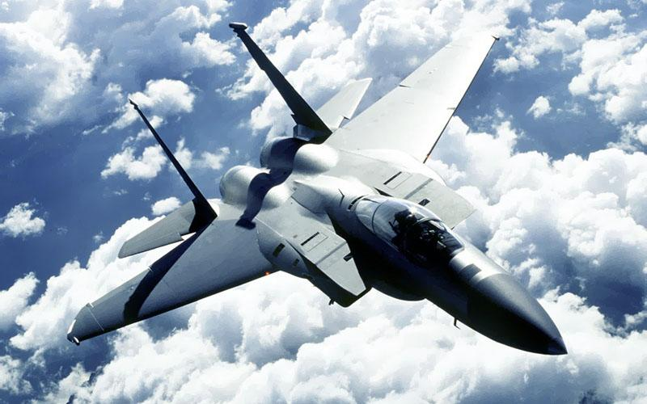

title: 航空知识（2）
date: 2006-12-29
categories: 航空知识

凡事都有个对比，来看看美军可三代重型空优战机。和SU-27比，孰优孰裂？（个人喜欢SU-27，漂亮）

F-15:

    研制国家：美国，名称：鹰（Eagle）

一、概述：  
    F-15是美国波音公司麦克唐纳飞机和导弹部（原麦道公司）研制的双发重型超音速制空战斗机，主要用于夺取战区制空权，同时兼具对地攻击能力，是美国空军的主力战机。  
    1965年，美国空军开始考虑研制用于取代[F-4](mk:@MSITStore:C:/Documents%20and%20Settings/Administrator/桌面/飞机手册1.CHM::/f-4.htm)“鬼怪”式战机，并于1968年正式发出研制超音速制空战斗机的招标。1969年6月指定麦道公司、费尔柴尔德和北美罗克韦尔三家公司提出设计方案。1969年12月选定麦道公司作为主承包商。并签订了制造20架原型机的合同，其中两架为双座教练机，3架供静力和疲劳试验用的机体。  
    F-15的首架原型机于1972年7月开始试飞，1974年9月首架生产型首飞，1974年11月开始交付部队。早期的F-15有A、B两种型号，A型为单座型，B型为双座教练型。随后，麦道公司对F-15A/B进行了改进，于1979年6月推出F-15C/D型。  
    为使F-15具备对地攻击能力，80年代麦道公司还研制了F-15E对地攻击战斗机。截至2004年底，美国空军共生产了355架F-15A，57架F-15B，408架F-15C、61架F-15D，226架F-15E。此外，美国还向日本、以色列、沙特和韩国出口了F-15型飞机。  
    F-15采用固定式上单翼，不带前缘和后缘机动襟翼。选用固定弯度的普通锥形扭转机翼提高机动性。前缘后掠角45°，展弦比为3，根梢比为4，相对厚度翼根处为6.6％，翼尖处为3％。上反角1°，安装角0°。机翼结构为多梁抗扭盒型破损安全结构。前梁为铝合金，后三根梁是钛合金的。机翼的前、后缘，副翼和襟翼均为铝合金蒙皮全铝蜂窝夹层结构。C、D型飞机上，内侧机翼的前部和后部都扩大成整体油箱。机翼无除冰系统。  
    F-15机身底部外形略带弯曲。进气道外侧凸出，安装有机炮，此外还起到翼根整流和安装平尾及垂尾的作用。此处突起在大迎角时产生涡流，可推迟机翼失速和提高尾翼效率，起到边条作用。背部座舱后边装一块最大开度为35°的减速板。全金属半硬壳式结构机身由前、中、后三段组成。铝合金结构前段包括机头雷达罩、座舱和电子设备舱。中段是与机翼连接部分，部分采用钛合金件承受大载荷，约占此段重量的20.4％。前三个框是铝合金的，后三个框是钛合金的。后段为钛合金结构发动机舱。  
    全动式平尾带有锯齿形前缘，大面积双垂尾可满足高速飞行和机动需要。平尾和垂直安定面均为硼纤维复合材料。抗扭盒是钛合金，蒙皮是全厚度铝夹芯和硼-环氧复合材料面板构成蜂窝壁板。前后缘采用全铝蜂窝结构。方向舵采用碳纤维-环氧复合材料梁肋和硼-环氧面板和铝夹芯蒙皮。  
    电子系统：F-15的电子系统由平视显示仪、APG-63（或APG-70）火控雷达、惯性导航系统、飞行控制系统、高频无线电通信设备、战术导航系统、自动着陆系统组成。另外还装有一个中央电子战系统、敌我识别系统、电子对抗装置和中央数字式计算机。  
    F-15的平视显示仪能将机上综合电子系统收集到的各种基本飞行信息显示在飞行员面前的宽幅屏幕上。该显示仪能在任何光线条件下正常工作，它使得飞行员不需要低头查看驾驶舱内的各种仪表，就能够完成跟踪并击落敌机的过程。  
    APG-63或APG-70多普勒通用火控雷达系统具有上视上射能力，也具有在地面杂波干扰的条件下发现低空目标的能力。该雷达能在超视距到近距离、高空到贴地高度的范围内搜索和跟踪普通敌机或高速的小型目标，例如空空导弹。该雷达将探测到的信息送到中央计算机，以更有效的运用武器。在近距格斗中，该雷达自动跟踪敌机，并将信息显示在平视显示仪上。F-15的电子战系统能自动提供告警，并对选定的目标实施自动电子对抗。具体系统包括：进攻性电子系统：AN/APG-63 X波段脉冲多谱勒雷达（A/B型装）、AN/APG-70 X波段脉冲多谱勒雷达（C/D型装）、AN/APX-76敌我识别问询机。  
    防御性电子系统：AN/ALQ-135(V) 机内电子干扰设备、AN/ALQ-128雷达告警设备、AN/ALR-56 雷达告警接受机、AN/ALE-45箔条弹投放器。  
    导航系统：AN/ARN-112仪表着陆系统、AN/ARN-118塔康系统、AN/ASN-109惯性导航系统。  
    通信系统：AN/ARC-190高频无线电通信电台、KY-58保密话音通信系统。  
  
二、性能指标  
1、F-15C/D战术战斗机  
    外形尺寸：机长 19.43米，机高 5.69米，翼展 13.05米，机翼面积 56.48平方米，主轮距 2.75米，前主轮距为 5.42米。  
    重量及载荷：空重 12975千克，最大起飞重量 30845千克，最大外挂武器载荷 10705千克。机内油箱携带油料 5260千克，外挂油箱携带 5395千克。  
    性能数据：带保形油箱转场航程 5745千米，不带时 4630千米；实用升限 19696米，最大平飞速度为2.5马赫；续航力在空中加油时为15小时，巡航速度 915千米/时。  
　　武器装备：右翼根下固定安装有一门M61A1机炮，备弹940发。机腹可携带四枚AIM-7F/M“麻雀”导弹、四枚AIM-120先进中距空空导弹、四枚AIM-9L/M“响尾蛇”近距空空导弹和四枚AGM-88导弹。最大载弹量10705千克。  
    动力装置：两台普拉特·惠特尼公司F100-PW-100加力式涡轮风扇发动机，推力 2\*62.5千牛，加力推力 2\*105.9千牛。  
  
2、F-15E战术轰炸机  
    外形尺寸：机长 19.43米，机高 5.63米，翼展 13.05米，主轮距 2.75米，前主轮距 5.42米，机翼展弦比 3.01。  
    重量及载荷：空重 14379千克，最大起飞重量 36741千克，最大外挂载荷 11113千克（包括武器和油料）。  
    性能数据：转场航程 5745千米，实用升限 18290米，高空时最大平飞速度 2655千米/时。在最佳高度，巡航速度 917千米/时。最大作战半径 1853千米，标准作战半径 1270千米。  
    武器装备：右翼根下固定安装有一门M61A1机炮，备弹512发。可携带四枚AIM-7F/M“麻雀”导弹、八枚AIM-120先进中距空空导弹、四枚AIM-9L/M“响尾蛇”近距空空导弹和四枚AGM-65导弹。另外还可以携带CBU-52、CBU-59、CBU-71、CBU-87、 CBU-89 、MK-20。  
    动力装置：两台普拉特·惠特尼公司F1OO-PW-220加力式涡轮风扇发动机，最大推力 2\*65.7千牛，1991年后改装为FlOO-PW-229，最大推力 2\*79.2千牛，加力推力 2\*129千牛。  

