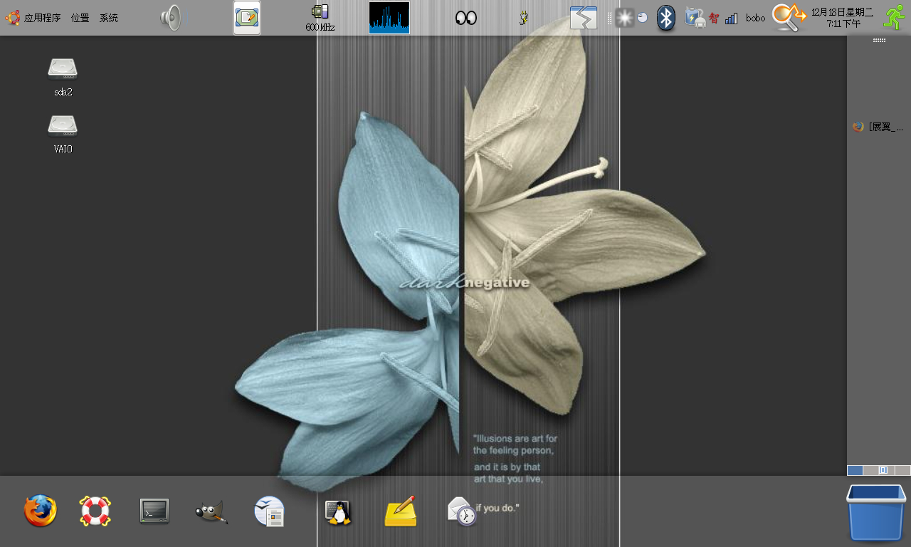

title: 终于有声音了！
date: 2007-12-18
categories: 计算机类

经过走访多个网站，我的ubuntu终于出声音了。呵呵。方法很简单，没有用到编译之类的。具体为什么，我现在也不太明白。  
       找到了台湾论坛上的一个方法。分享一下。  
我是在這裡看來的，不過我沒編譯音效核心(不管是在7.04 or 7.10)，我直接在終端機打上alsamixer (呼叫出alsa音量控管介面)，不過我沒看到作者所說的surround，所以我把所有的音效全開到最大，如果有遇到音效開不起來的，就注意一下圖示下 方是不是有"MM"，如果有，就按"<"及">"，就會發現變成數字"0"，此時再按"上"鍵就可以開嘍，不過如果還是不能開，就算啦，我也 不知為什麼  
重點來嘍~要特別注意哦，要有心理準備哦，有一個名稱叫「External」的預設值是"00"，此時就按"<"及">"讓他變MM，奇怪的事情發生嘍~聲音出來嘍~而且還超大聲的，每次我在搞這個時，我家的狗「阿貴」總是會嚇一大跳。  
調完之後，我只是按一下Esc退出，沒有另外像作者一樣再做存檔的動作，音效還是在。  
      

