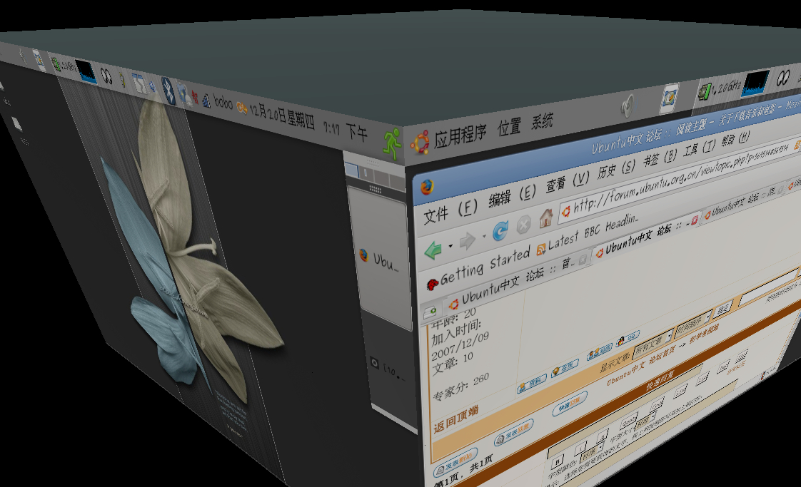
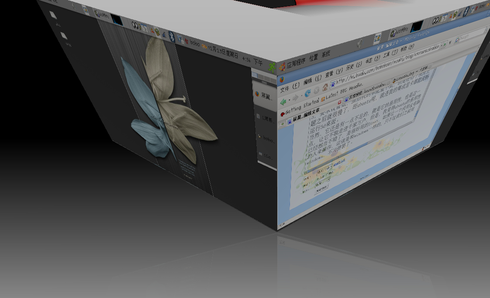

title: 为什么我改用了ubuntu
date: 2007-12-21
categories: 计算机类

很多人不理解，用了那么长时间的“瘟到死”（windows）,为什么改用了一个不好使的ubuntu了呢？我还是说一下我进入ubuntu世界的过程吧。恩，先是看到微型计算机上的介绍，不知是不是vista太让人伤心了。呵呵，12月下的微型计算机又介绍了苹果的系统leopard。最开始是看中了它绚丽的桌面，我看不惯xp的蓝天白云，就来到了ubuntu的3D桌面中来了。  

（我桌面的3D效果）  
恩，可是刚开始不是这么顺利的，一装完就没声音，查了很多方法，就是解决不了，中间启动项坏了，现在想来用光盘重装一次，就能保留其它的文件，但是当时没有想出办法。就全都删了，如果是xp，我肯定恨死了，但是ubuntu，我却没有丝毫怨言，反而增加了我用好ubuntu的决心，就这样，我又一次开始了ubuntu之旅，这一用已经半个月了，半个月没用xp了，感觉真的很好。  
    linux比windows好在哪里？  
1，更好的安全性和稳定性，再也不用每天开机升级病毒库了，不用15天下一个新的杀毒软件了，不会因死机等的不耐烦。  
2，开源软件丰富，大量的免费软件。不用安完一个程序之后到网上找cd key了，不用苦苦寻找破解版软件了。apt-get可以来轻松解决。  
3，要求设备低，虽然我的本配置不低，但是在xp下装完主题之后就很慢了，而ubuntu呢，就连我的集成显卡都能流畅运行3d桌面。  
当然，它还是有一点不足的，就是它的易用性，也是这一点，让它不能走进千家万户，但是，我觉得ubuntu的易用性已经相当不错了，是很好用的linux，如果让一个没用过电脑的人来操作，应该是和windows一样的，只不过我们之前用windows，不习惯罢了。  

希望跟多的人走进ubuntu的世界。
