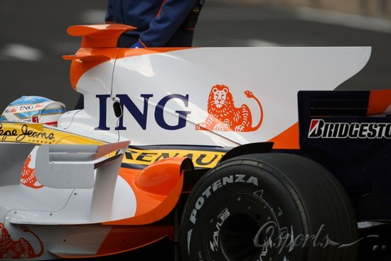

title: f1土耳其赛前瞻
date: 2008-05-11
categories:  体育

马上f1土耳其大奖赛的决赛就要开始了。昨天，好久不看f1的我又看了看排位赛，不看不知道，一看吓一跳。现在f1的变化正是不小阿。  
说说气动外形，车头桥梁结构已经出现在许多车队。另外要说的是雷诺，在背后多了个鱼鳍。从表象上看，这增加了左右摆动向的稳定性。但是，这也增加了转弯的阻力，容易摆向不足，而红牛车队也已经效仿，预知效果如何，还看今天的比赛。  

