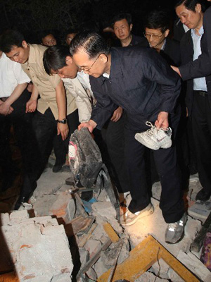
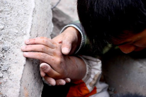
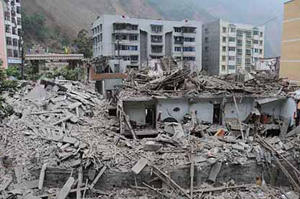
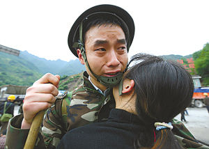
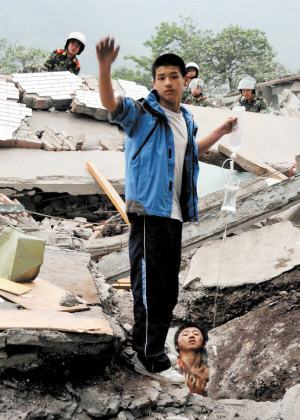
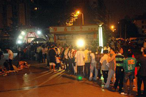
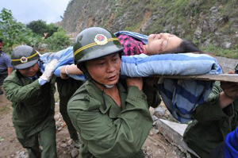

title: [感动中国]抗震救灾中最感人的十个瞬间
date: 2008-05-20
categories: 新闻焦点

【瞬间一】66岁的温家宝冒雨攀上瓦砾堆 不慎摔倒手臂出血  
  
在一次营救失败后，温家宝总理冒雨攀上瓦砾堆，组织再次营救。66岁的总理不慎摔倒，手臂受伤出血，但为了抢救遇险群众，他把要给他包扎的医务人员推开了。  
  
  
▲5月12日，中共中央政治局常委、国务院总理温家宝抵达地震灾区四川省都江堰市，指挥抗震救灾工作。  
这是温家宝从都江堰市一所学校的废墟中捡起学生的鞋子和书包，心情沉重。  
  
【瞬间二】双臂护住4个学生 老师把生命给了孩子  
  
“我们发现他的时候，他双臂张开着趴在课桌上，身下死死地护着四个学生，四个学生都活了！”一位救援人员向记者描述着当时的场景。  
  
这位英雄教师是德阳市东汽中学教导主任谭千秋。  
  
  
▲5月14日，张关蓉在丈夫谭千秋的遗体旁痛哭。  
  
【瞬间三】看书缓解心中的害怕 女孩废墟里读书  
  
邓清清被武警水电三中队的抢险官兵救了出来。让陈老师与官兵们感动的是，这个女孩被救 出时，还在废墟里面打着手电筒看书。她说：“下面一片漆黑，我怕。我又冷又饿，只能靠看书缓解心中的害怕！”她的诚实如同她的坚强一样，让听者无不动容。 陈全红一下子哭了，抱着清清连说：“好孩子，只要你能活着出来，就比什么都好。”  
  
  
▲劫后余生的学子  
  
【瞬间四】战士跪地而泣：求求你们让我再去救一个  
  
“你们让我再去救一个，求求你们让我再去救一个！我还能再救一个！”一个刚从废墟中带出了一个孩子的战士跪了下来大哭，对拖着他的人说。所有人都哭了，然而所有人都无计可施，只能眼睁睁地看着废墟第二次坍塌。  
  
  
▲5月13日，救护人员在汉旺镇武都小学废墟上抢救幸存的小学生。  
  
【瞬间五】废墟中埋藏着生存的顽强 父母以死换来孩子的生  
  
四川省北川县商业街惨烈的一幕，让所有参与抢救的武警战士眼泪打转：一对年轻的父母，为了保护孩子，一个压一个地护在两岁多女儿身上，结果，以自己的死换来了孩子的生。  
  
  
▲这是四川省北川县县城内垮塌的建筑物  
  
【瞬间六】妻子说“爱你”支撑瓦砾下的丈夫  
  
“我不行了，你快离开这里！照顾好孩子，好好生活下去。”“老公，不要放弃，马上就会有人来救你！”13日上午，都江堰金凤乡政府家属区里，朱芙蓉流着泪朝废墟里呼喊，鼓励丈夫谭刚义坚持下去。  
  
  
▲一对青年爱人重逢后紧紧抱在一起。他的妻子刚刚从震区汶川县走出来。  
  
【瞬间七】初三男孩手刨4小时救出同班女生  
  
漩口中学初三5班的学生向孝廉是被同班同学马健喊醒的。“他在外面喊，孝廉，你在哪里？我 就醒了。他一再说，你要坚持，你要坚持……”向孝廉身上压着厚厚的泥土和水泥块，马健就用双手在外面刨。“我哭着告诉他，马健，你别走，如果你要走，就等 我死了再走吧。马健说，我不会走，你是我们班上年纪最小的，也是生命力最旺盛的，这点困难难不倒你。”大约4个小时后，马健终于把她刨了出来。这时，马健 的双手血肉模糊。  
  
  
▲一名北川中学学生在武警官兵帮助下救助被压在瓦砾堆中的同学。  
【瞬间八】震后一日 成都3000市民自发献血  
  
5月12日地震发生后，许多成都市民通过广播、电视得知抗震救灾急需鲜血，立即自发前往两个爱心献血屋以及两辆流动采血车献血，到13日下午5点，全市已有3000多名市民到市血液中心9辆采血车、5个爱心献血屋义务献血。  
  
  
▲12日23点00分，近千成都市民聚集在春熙路献血点为灾区群众献血，队伍蜿蜒近两百米。  
  
  
【瞬间九】浙江母亲短信请求送儿上四川灾区前线  
  
“丁教你好，我通过电视看到四川汶川发生了强地震，我看到了很多老人学生和孩子失去了 生命，我很痛心，我看到那里急需消防官兵的援助，如果你们部队要去救援的话，请你一定要把蒋华派去！拜托了！” 14日上午，浙江省绍兴县消防大队指导员 丁周权打开手机，看了这样的一条短信。发短信的是绍兴县消防大队一级士官蒋华的母亲卢女士，她想到了儿子在浙江做消防战士，于是便有了之前的一条短信。  
  
  
▲救援人员在抢救受灾学生。  
  
【瞬间十】牵住你的手就有希望！加油！  
  
  
▲5月13日，一位护士不停地与一位被困孩子说话，鼓励他等待救援。
