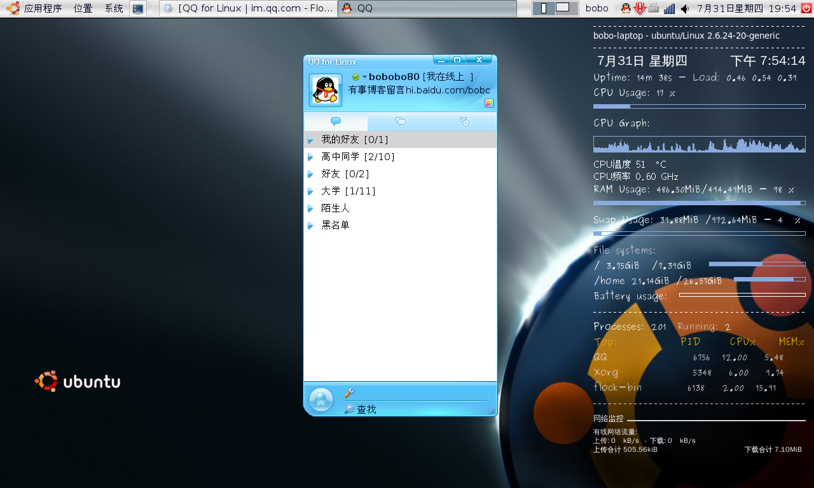

title: qq for linux发布
date: 2008-07-31
categories: 计算机类

在7月的最后一天，qq for linux终于发布，我也下载试用，安装很简单，解压直接用，建议不要用deb包的，tar就很好，自己加上图标连接就行。加张图上去。  

  
该版本没有截图，传文件功能，还比较简单，功能还比不了eva，不过由于是官方版本，不会出现腾讯修改协议导致的非官方出现的无法登录现象。
