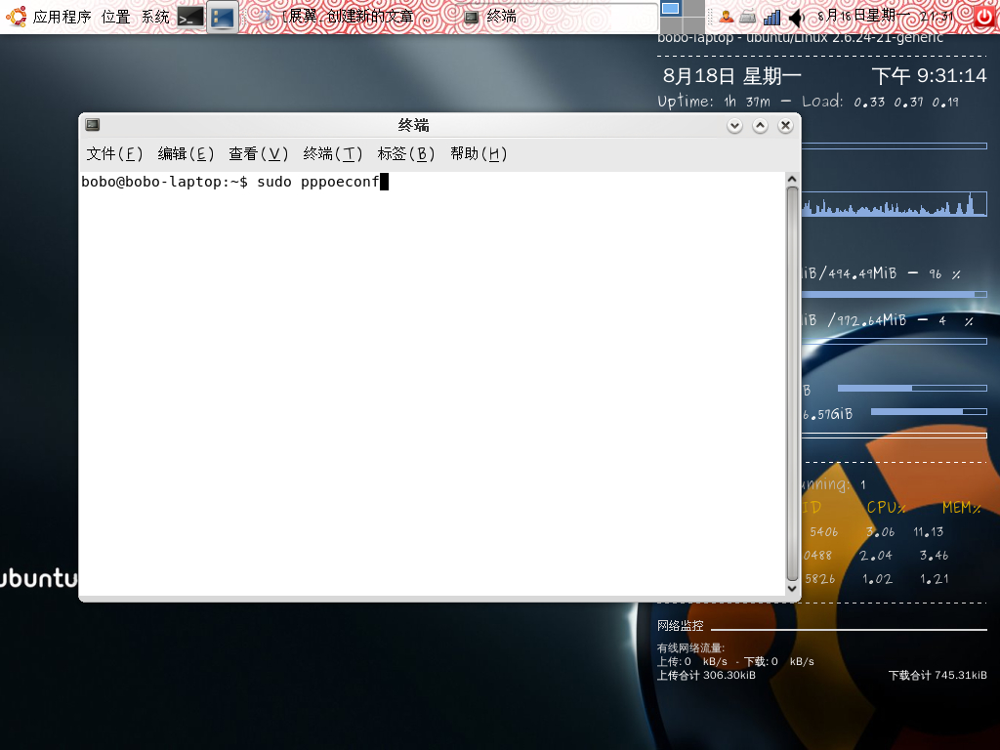
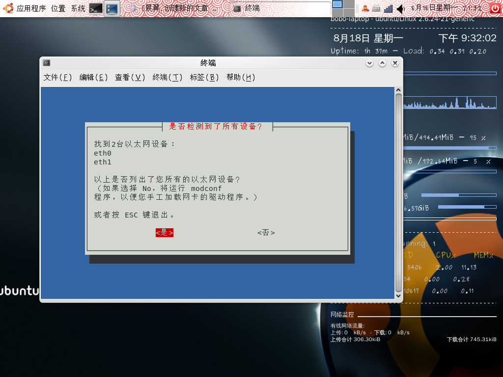
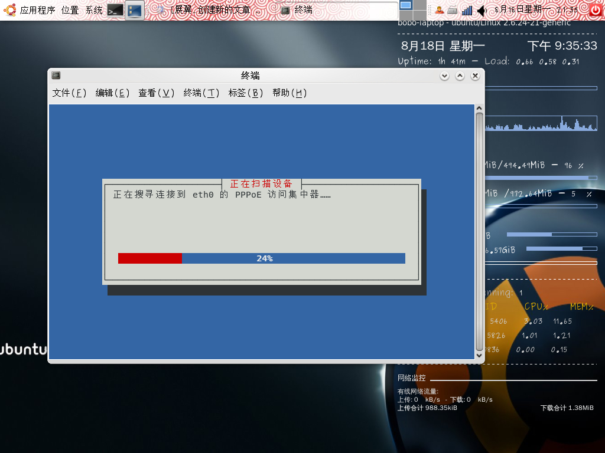
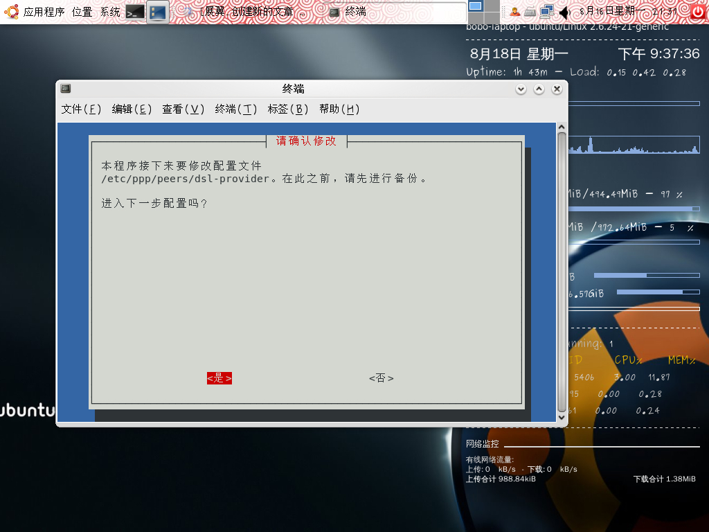
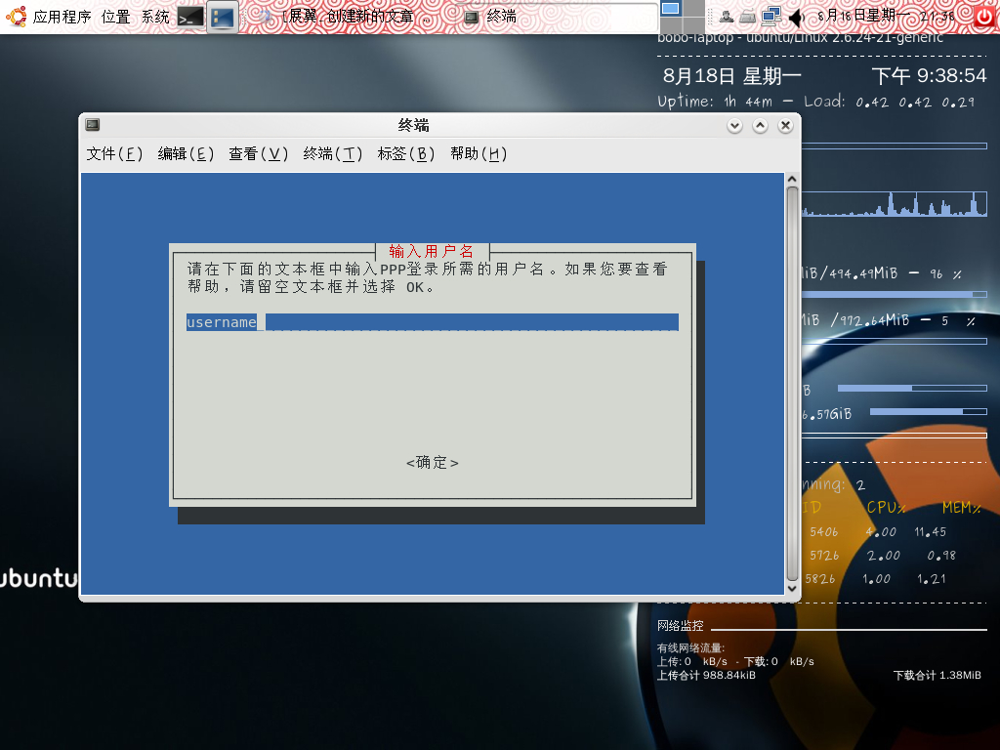
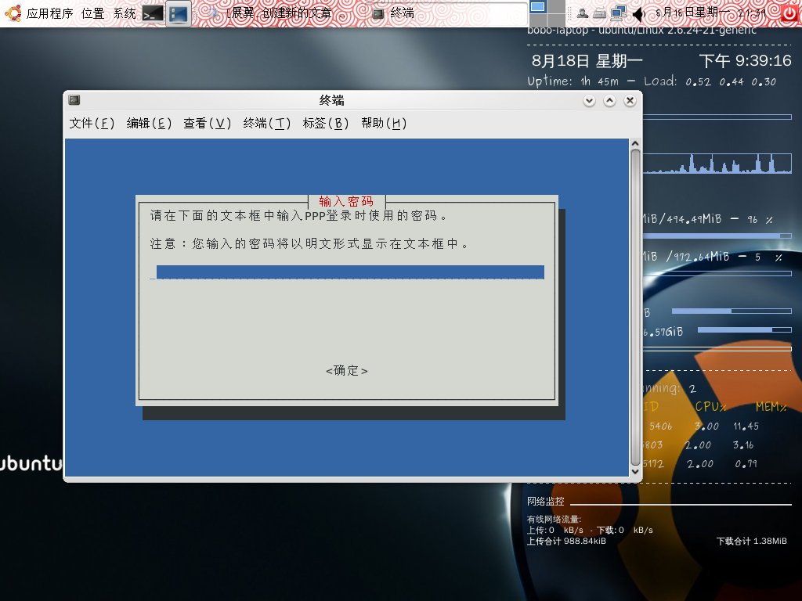
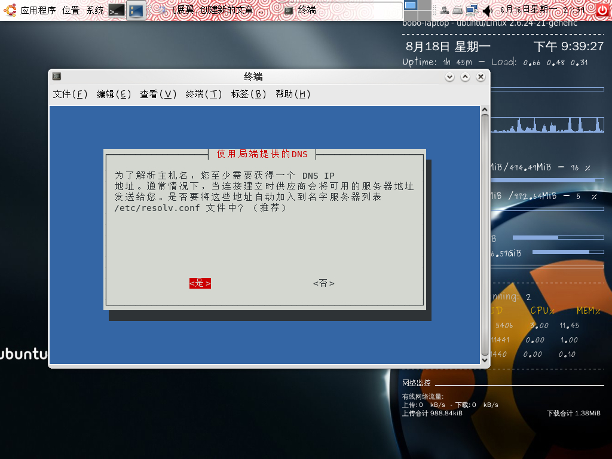
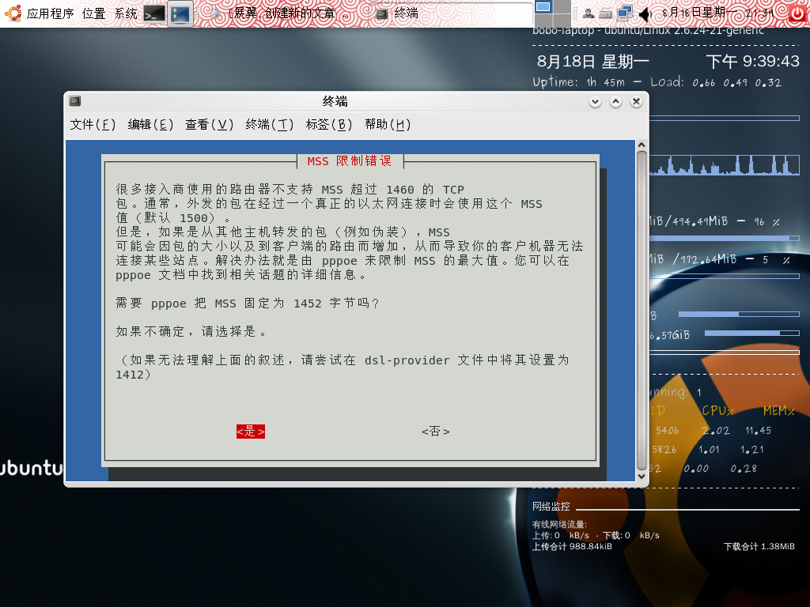
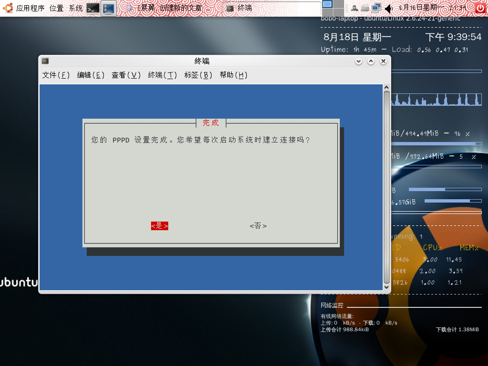
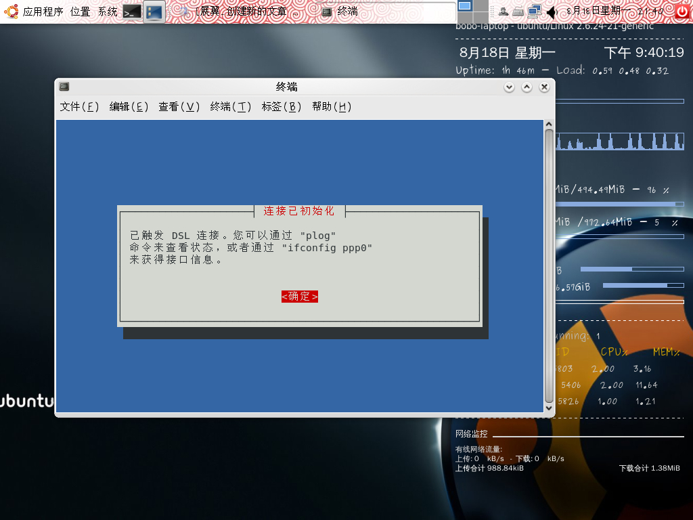

title: ubuntu如何拨号上网
date: 2008-08-18
categories: 计算机类

[step by step 带你来到linux的精彩世界。  
](http://hi.baidu.com/bobobo80/blog/item/0528af01a4168d05728da55c.html)  
使用ubuntu进行拨号上网。  
该方法适合使用pppoe协议上网的用户。  
首先，右上角，应用程序－－附件－－终端。  
输入sudo pppoeconf  
再输入密码，注意输入密码时图像上不会显示出来，输入完按回车即可。  

之后进入这个图  

选择是  
之后出现  

选择是  
之后是  

选择是  
之后是  

注意把username先删掉，输入用户名  
之后是  

输入密码，注意是明文显示的，别让别人看到。  
之后是

选择是  
之后是  

选择是  
之后是  

选择是  
之后是  

选择是  
之后是  

选择确定。  
好了，现在可以上网了。  
总结一下，除了输入用户名密码时输入用户名密码，其他时候选一律选是就可以了。简单吧。
