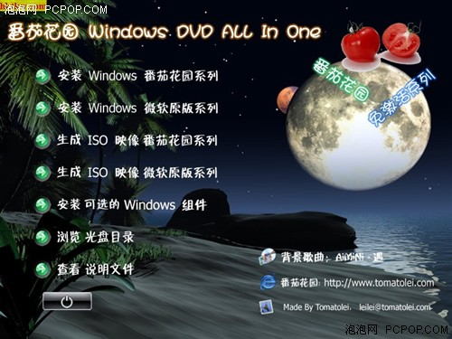

title: 番茄花园作者被抓 改版XP审判日将近（转）
date: 2008-08-20
categories: 计算机类

转自http://www.pcpop.com/doc/0/322/322057.shtml      
        泡泡网资讯频道8月20日，据媒体消息，番茄花园美化修改版Windows XP的作者、软件下载网站番茄花园（toMOTOlei.com）站长洪磊已经被警方拘留，相关网站已被封闭，服务器及洪磊的笔记本均被警方带走。此外，成都红果科技有限公司因为洪磊提供了技术开发支持而被查封。

    洪磊，网名累累，与另一位网名“大番茄”的技术爱好者一起制作了番茄花园美化修改版Windows XP操作系统，二人还同时运营一个名为“番茄花园”的软件下载网站。

  
番茄花园版安装截图（配图）

    番茄花园美化修改版Windows XP，是洪磊和大番茄对微软Windows XP系统的主题、桌面、按钮等外观进行美化，取消正版验证程序，对不常用功能进行关闭和卸载，并打开源系统中部分功能模块限制，和集成实用小工具后的一款 软件。由于以上的修改并没有微软的授权，因此，番茄花园版Windows XP其实只是一款盗版软件。

    不过，据业内人士预计，番茄花园版Windows XP的装机量可能超过了千万台。这一数量为番茄花园以此牟利创造了条件。

    正如珊瑚虫QQ的作者一样，第三方软件是否涉嫌违法，是否将获刑，完全取决于作者有否从中“牟利”。尽管大多数网民仍为珊瑚虫喊冤，但其安装插件从中获利却被法院认定为事实，因此，陈寿福获刑也是法理之中。

    前有珊瑚虫案为鉴，番茄花园是否将步其后尘，唯一的判别标准将是一个字——利。

    据此前论坛爆料的消息，称番茄花园老大被抓后，已查处其帐户200余万元的存款。这可能是番茄花园非法牟利的所得。不过，目前该消息尚未得到证实。

    其实，人们对于番茄花园牟利的猜测也并非空穴来风。一些使用者表示，这版操作系统安装了诸如阿里巴巴的竞价、3721、一搜、多多QQ表情、CNNIC、播霸网络电视等 流氓软件。尽管番茄花园声称这些软件是第三方公司下载番茄花园后自行装上后，再为用户提供下载或是通过光盘传播的，但是，从番茄花园自己的网站上下载的美 化版XP，同样发现了雅虎助手和易趣网的插件。番茄花园同样辩称，这两款软件安装时有提示、可卸载，因此不属于流氓软件。

    即便如此，捆绑插件已经是不争的事实，实际上，按照行规，批量预装插件是可以按照装机量获得广告收入的。

    资深业内人士分析认为，番茄花园应该是因捆绑插件，从中获利而被查封的。不过，番茄花园成为被打击的第一人，也不排除“枪打出头鸟”的可能。所以，同属修改版XP圈子的深度版、东海版以及龙卷风等不排除遭到同样命运的可能。

可怜的番茄阿，装机必备可能从此离我们远去，重装无数的我只能在此祝番茄一路走好。自己刻了张番茄留念。
