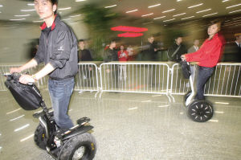

title: 探秘两轮自平衡车
date: 2008-08-26
categories: 科技

奥运期间，在鸟巢和机场执勤的警察使用上了一种新型两轮车（如图）。  

参数上来讲，该车时速可达20公里，行程里数可达40公里，使用锂电，无排放，适合在密集人群中执行任务。  
  
可能很多人疑惑两轮车是怎么保持平衡的呢？我也小研究了一下。来揭秘一下两轮自平衡车。  
  
从原理上讲,应该是很简单的，那就是应用陀螺仪原理，该原理应用到很多地方，比如导弹，火箭的姿态调整，方向确定等等。  
  
我学的也不深，只是从直观上说说。陀螺仪的转子高速旋转时具有了一个物理特性－－定轴性。直观的讲就是转子在旋转的轴上就一直转了，不改变在惯性空间的方向了。简单的说，通过陀螺能定一个方向，而空间来说需要三个轴来定位姿态，所以，至少要三个陀螺。  
  
有了姿态这些数据，还有加速度感应器，再经过一系列复杂的运算，来控制车子。人身子前倾，重心向前，姿态感应，车子向前加速，由此来用重力的分力来平衡。  
  
至于转向，当人倾斜车把，车子的两个轮差动，就是不一样的速度转，实现转弯。向前倾斜时，马达向前驱动两个轮子，来阻止倾倒。当向后倾斜时，马达向后驱动两个轮子。当乘车人向左或向右转动车架时，马达使一个轮子的速度高于另一个轮子，从而达到人车合一、运动自如的境界。  
  
说起来原理很简单，但真正做出来是很不容易的。我到中国代理销售该车的网站上下了一份广告，这叫一个费事，网速极慢。百度空间不能传附件，我看看我的网络硬盘，带会给个链接。
