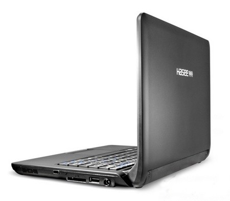
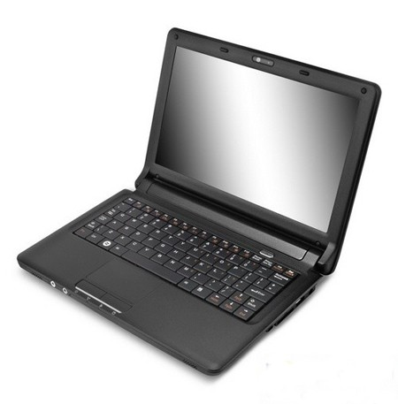
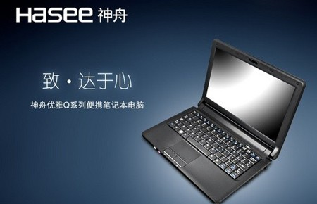

title: 神舟1999小本（转）
date: 2008-08-31
categories:  计算机类

[神舟 1999（后续报道，配置，图片)](http://hi.baidu.com/bobobo80/blog/item/da51a4fba519db244f4aeaa5.html)http://hi.baidu.com/bobobo80/blog/item/da51a4fba519db244f4aeaa5.html  

[泡泡网](http://www.pcpop.com/)资讯频道8月29日，素有“价格屠夫”之称的神舟电脑，在多次刷新笔记本市场的低价记录，从4999元、3999元一直杀到2999元之后，震撼推出1999元笔记本，再次触碰价格底线。

    其实在今年7月神舟的笔记本新品发布会上，神舟董事长吴海军就曾经透露会在今年8月将推出1999元笔记本，如今1999元笔记本从幕后走到市场，也引发了众多网民惊呼，“一个手机的价钱可以把笔记本搞定了”。

    据悉神舟这款1999元的小本型号为优雅Q120C，采用8.9英寸屏幕，Atom N270[处理器](http://product.pcpop.com/CPU/00000_1.html)，40GB硬盘，标配LINUX系统，看来整机的性价比确实非常高，足以真正秒杀当前所有的Netbook低价小本了。

    但是在女孩子买本本的时候不光是看性能，外观当然也是不容忽视的原因了，这次1999元小本采用了主流的黑白色外，还有一款颜色专门为卡哇伊的女生提供的粉红色。看来不知道又要迷倒多少女生了。

    神舟董事长吴海军表示，虽然只有1999元的价格，每台仍有5%至10%的利润空间。同时，神舟不但会推出1999元的便携本，神舟还会在未来推出12英寸、13英寸、14英寸以至于更大尺寸的1999元笔记本。

    面对这场笔记本价格大战，作为买家的我们就静观其斗好了。■
