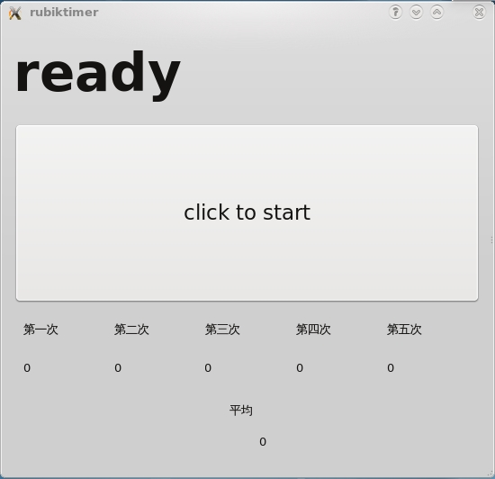
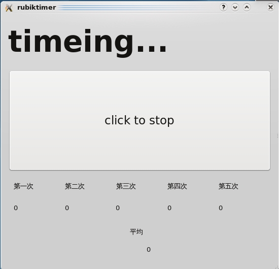
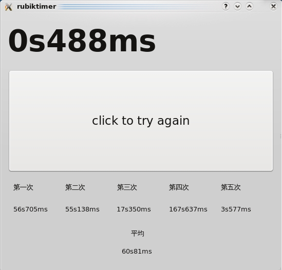

title: 练习——qt编写的魔方计时器0.1版
date: 2009-01-27
categories: 计算机类

今日练习了一下自己搞一个小程序，由于非ie的浏览器用魔方小站的计时器会有一点小问题，于是，自己也编一个计时器。虽然功能还不完善，但好歹能计时了。呵呵。等以后深入学习了，再完善吧。  
  
使用了qt的qtcore和qtgui库。  
  
linux用户可直接下载运行（需有qt库）  
[http://www.namipan.com/d/c8d11e6ad7f2ddf66a1f61240a2cc5fd0c1e66b5458f0000](http://www.namipan.com/d/c8d11e6ad7f2ddf66a1f61240a2cc5fd0c1e66b5458f0000)  
源代码  
[http://www.namipan.com/d/4aa326377478fe73746fbdc2b636f0bf4b888e2bc79b0000](http://www.namipan.com/d/4aa326377478fe73746fbdc2b636f0bf4b888e2bc79b0000)  
windows请自行编译生成exe文件。  
  

  

