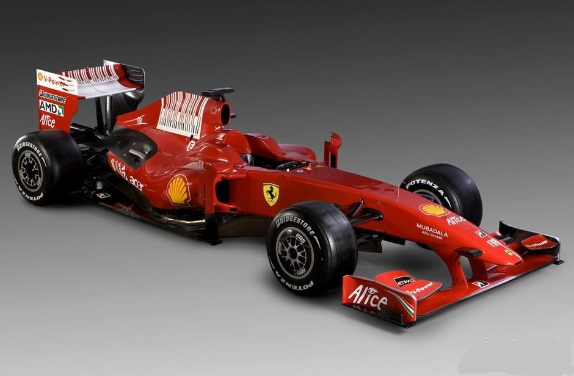
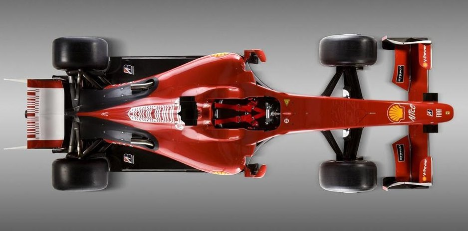
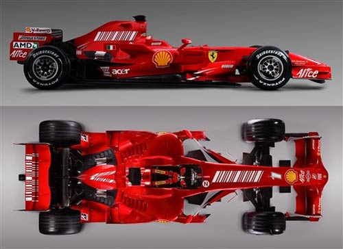
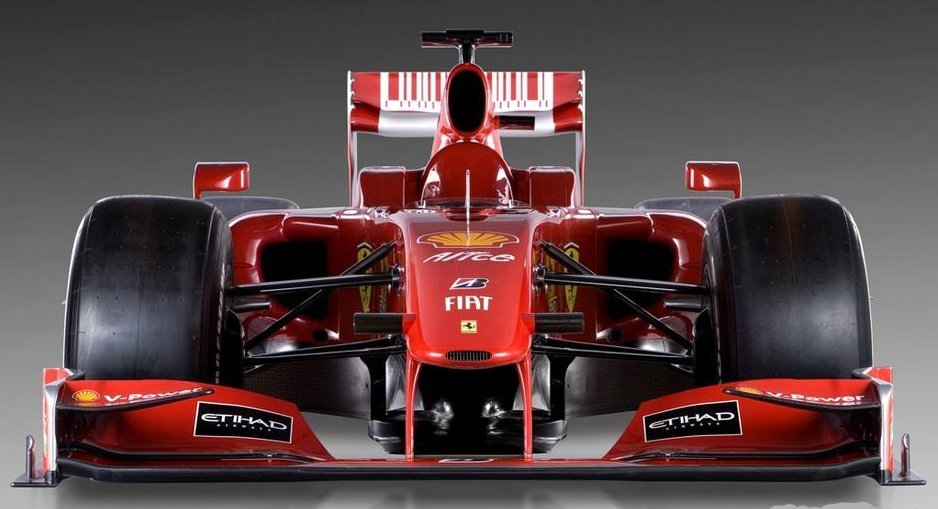
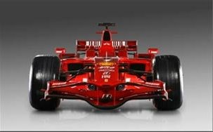
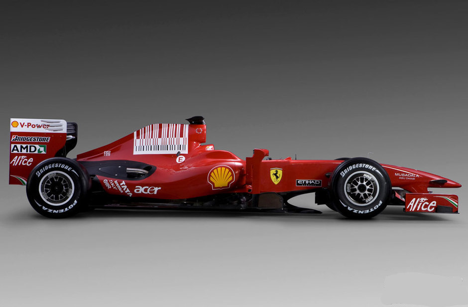
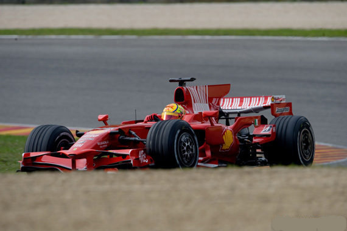

title: 来看看09年法拉利的新车F60
date: 2009-02-08
categories: 体育

点击可放大。  

F60  
1月12日，法拉利发布了09年的新车F60，不同以往将年份加入到名字中，2009年是法拉利连续第60年参加F1大奖赛，因此09款赛车被命名为F60。  
由于2009年新规则有三大变化，所以车型外观，也有很大变化。  
  
2009年的一级方程式赛车将采用光头胎，但新空气动力学规则的实施将让赛车的下压力大幅降低，与此同时，赛车还将使用一套可以向其提供额外动力让其可以获得短暂助推的能量回收系统。  
  
据说光头胎将为赛车提高2～3秒的成绩。  

  
根据2009年的空气动力规则，赛车的前翼只能采用一个标准化的中段布局，与目前复杂的中段空气动力学设计相比，这将大幅度降低该部分的空气动力学效应。2009年的规则还对赛车车身上部可以用来产生下压力的侧分流板和可附载的小翼进行了限制。  

  
F60

是不是在09年就看不到前车身上类似于飞机上的鸭翼了呢？  
  

  
上图是f2008的正视和俯视图。  
  
  
F60  
光头胎和变宽的前翼和变窄变高的尾翼。  

f2008  
  

F60  
这里发布的车没有采用上赛季后半段的尾鳍设计。不知会不会根据赛道不同而添加。  

F2008的“尾鳍”
