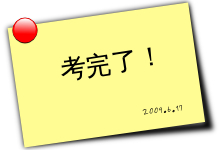

title: 考完了2！
date: 2009-06-17
categories: 一句话

总算考完了（除去那will挂掉的CET6），明天开始要接受virtools培训了，很辛苦阿，感觉考完了事情很多，下午买了个外置刻录机，晚上画了个T－shirt，看了这几天由于复习而没有看的网页。接下来要考虑一下考研考什么了。噢，还要加强打“铁”阿，为打出更强的铁而奋斗阿。  
为了熟悉CET6，到20好考完，发布的日志将使用英格力什，以熟悉一下半年没摸过的写作。祝我能考上300以上。
