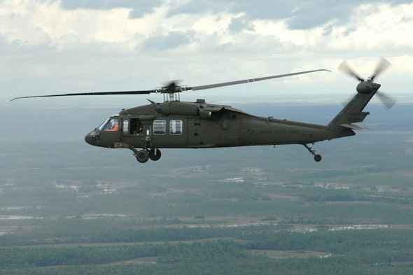
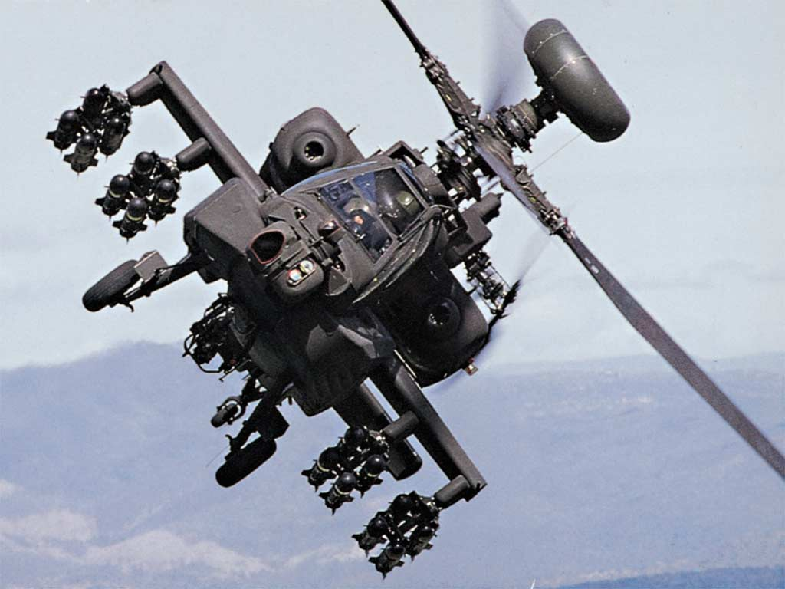
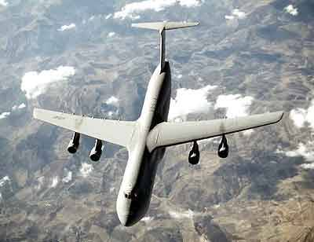
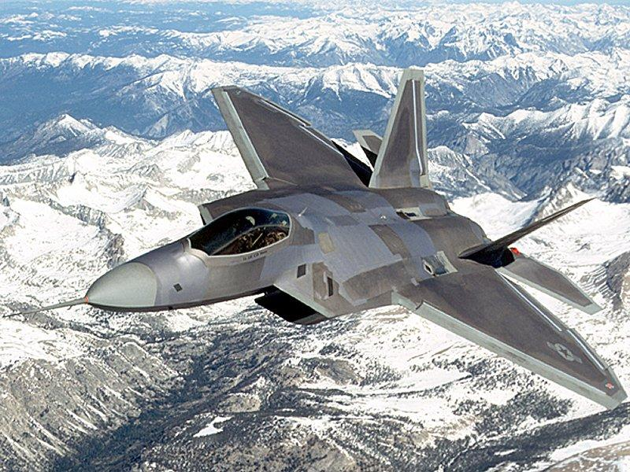
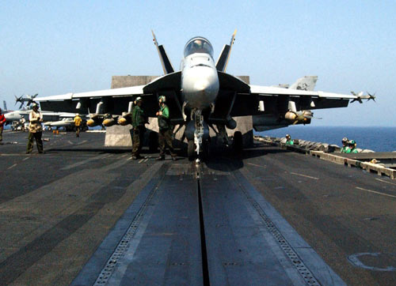
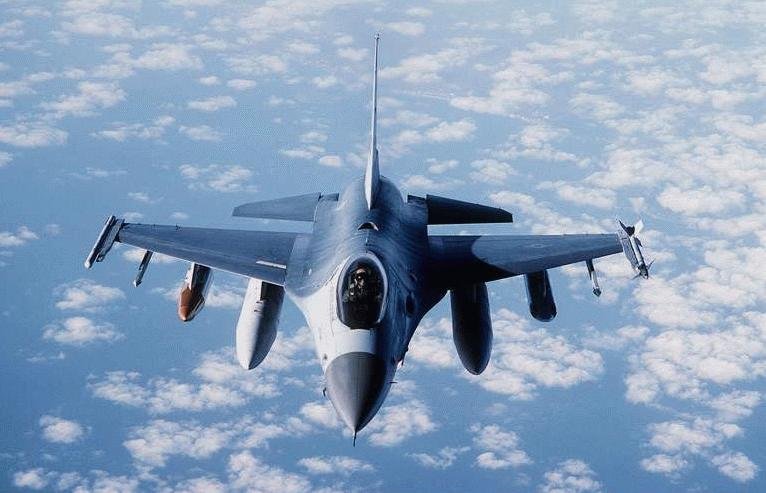
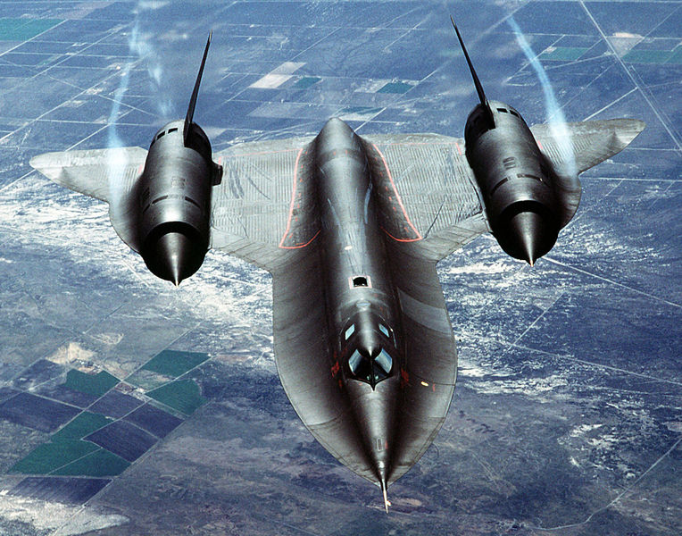
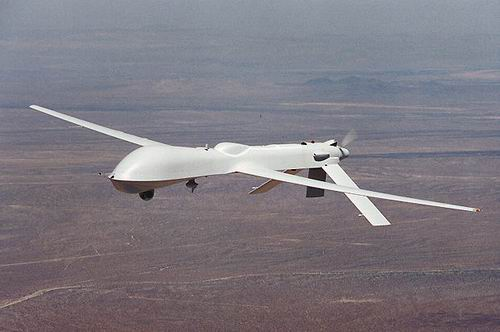
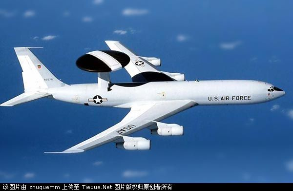

title: 变形金刚2中的飞机
date: 2009-07-10
categories: 航空知识

貌似变形金刚1，2是近些年到电影院里看的唯二的两部电影了。今天看了transformer2，（应该是这么拼）。来说说里面的飞机吧。第一部印象是有个f22是反派的一个机器人。2里依然有一架，还换了涂装，不知是后期改的还是？真的话，往吸波材料上换颜色可不是件"便宜"的事。  
直升机有很多黑鹰，很多黑鹰坠落。恩，应该是黑鹰，应该没看错，虽然直升机不熟。黑鹰平尾很有特点，容易辨认。  

黑鹰

阿帕奇有少量镜头。但是没黑鹰频繁，估计出场费不菲，那么多“凯夫拉”呢，身价不一样。  

阿帕奇  
片中还有其它直升机，但是由于镜头少和有我水平有限，没认出是什么。  
下面说说固定翼。  
运输机出现的镜头最多，但是，我对运输机的了解还不如直升机，所以，当中出现的C－17我看的时候认成了c－5。幸好片中提到了是c-17要不我还就一直错误的认下去了。  
经过查阅资料，发现c－5比c－17要大不少，体积上来说大概能大个50％。但是往往从图或视频中难以看出绝对大小，所以大小不是辨别的好办法。两者都是上单翼4发动机，单垂尾平尾上置（就是T型平尾）。所以我就给弄混淆了，最简单的辨别方法就是看翼梢，c－17有明显的翼梢小翼，而c-5没有翼梢小翼，从机身来看，c－5的机身截面为非圆形，为明显的双园叠加，而c－17机身截面大致为圆形。C－17比C－5要晚很多，所以从技术上讲C－17要先进很多，另外由于应用不一样，C－17可以在非常规跑道上起降，如海滩等。但是载荷容量来说C－5要比C－17大不少。上图。  

C－5“银河”  

C－17  
战斗机  
说说还算熟悉的。首先，来说说F－22，有个反派的伪装造型。在2中换了涂装，1里还是正规涂装，2里就变成了类似斑马色的颜色，这不是找让人发现吗。  

F22  
F－18，影片中出现在航空母舰上的那对，有很多折叠着机翼。有些镜头是在甲板上弹射起飞。当然，还有航母被击沉时，大量的F18也随之沉没。  

  
F－16.比较搞笑的是，在F18从甲板上起飞后，镜头随后给到天上，而这时，战斗机换成了F－16。在最后埃及那里，出来援救的就是F－16，据说这是装备最多的飞机还是装备国家最多的飞机，总之，这飞机很多，便宜。  

F－16  
其他飞机  
战斗机印象中就这几个。其它飞机有  
SR-71，这个可是主角。那个老爷爷霸天虎就是SR－71，SR－71在飞机界也算是比较老的了，都退役了吧，依然保持着有人驾驶最快飞机记录。  

SR－71  
B－1B，变后略翼轰炸机，恩，比较专业的是，影片中B1在高速飞行中机翼是大后略角，而要投弹时，机翼变为小后略角，符合实际情况。  

B－1B  
“捕食者”，影片中还出现了无人机，恩，我是忘了是不是了，但印象中是。  

捕食者  
E－3侦察机，没记错的话，有一个被击中坠毁的镜头。  

另外根据其他人说的，有A-10还有B－2，我实在是记不得了，这里先不写了，看看电脑版的再说。
