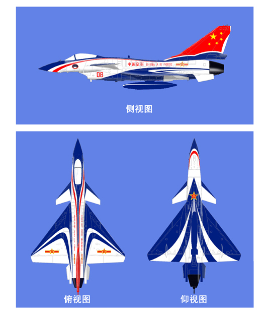

title: \"八一\"飞行表演队将喷涂新装 机垂尾涂饰中国国旗（转）
date: 2009-10-27
categories: 航空知识

  
  
转自：[http://military.people.com.cn/GB/8221/84385/140007/171705/10269928.html](http://military.people.com.cn/GB/8221/84385/140007/171705/10269928.html)  

歼-10表演机涂装方案

　　人民网军事在线北京10月27日电　（郭洪波、马超臣） 据空军装备部有关部门介绍，空军“八一”飞行表演队，将换装由中国自主研发设计的歼-10战机，并喷涂新装。这次涂装特点非常鲜明，展示了我国、我军良好形象和空军现代化建设的崭新风貌。  
  
涂装主题比较突出。整体方案以“中国空军”为主题，表演机垂尾涂饰的中华人民共和国国旗、机身中部涂饰的“中国空军CHINA AIR FORCE”字样和机翼上的机徽标注，凸显人民空军特色，具有鲜明的代表性。  
  
涂装寓意比较深刻。结合歼-10飞机气动外形所设计的“箭形”图案和机腹下的空军“飞天”标志，象征中国空军正在腾飞。  
  
涂装继承和辨识性好。以蓝、白、红三色、蓝色为主调的涂装采用多数世界著名飞行表演队表演机通行的涂色，且较好继承了歼—7EB/GB表演机的涂装风格，色彩协调，简洁明快，庄重美观，具有较好的继承性和辨识性。  
  
“八一”飞行表演队换装要驾驶我国自主研制最新型的表演机，并喷涂新装，表演队队长楼国强抑制不住内心的激动，“我们要把三代机的性能发挥到极限，创造更加完美的表演编排，不久的将来，我们将为全国观众呈上崭新的‘蓝天视觉盛宴’！”
